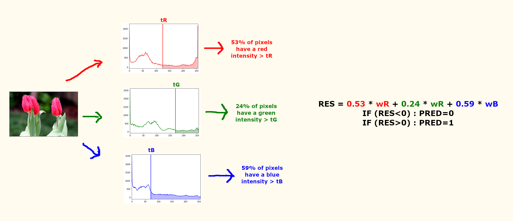

# Colour-Based Binary Image Classifier using Genetic Algorithm
Simple classifier based on color histogram. The classifier uses 6 values to classify pictures in two different classes and work like presented in the figure below :

The six values that interest us are tR, tG and tB (the treshold for each color) and wR, wG and wB (the weight of each color in the final operation). These six values are found using a genetic algorithm.

The genetic algorithm has to run for each dataset, there is not obsolut best classifier.

The results are not even close to the state of the art methods in image classification, mostly because we only use color histograms (and not even the whole distribution of the color histogram). At least, this method is really fast to make new predictions !

## Classes implemented

### Classifier

A classifier can only be created get evaluated. A subclass Classfier_Random allows to generate random classifiers for the first generations, else the Classifier is initialized given the attributes tR, tG, tB, wR, wG and wB. The evaluation method takes a dataset as argument and evaluates the accuracy of the classifier on this dataset.

### Generation

A generation is made of multiple classifiers. The generation can get evaluated, by evaluating each classifier. The most important function of a Generation is the one which allows us to create a new Generation by combining some of the better elements of the initial Generation.
This function allows to choose the mutation rate and the number of elements from which the next Generation will be computed.
This also keep track of the scores of previous generations in order to save the evolution in a file that could be studied later.

### Dataset

Given 2 folders that represent the 2 classes, the __init__() method will look for each image in this 2 folders and add their histograms to lists (data_1 and data_2). A function allows us to save the dataset.
